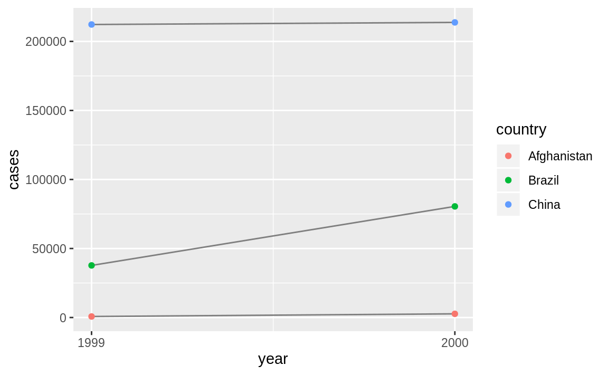
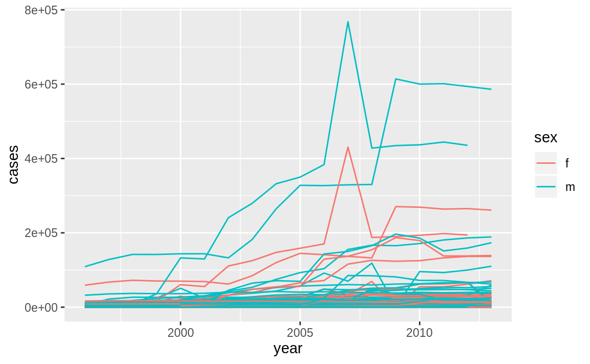

# Tidy data {#tidy-data .r4ds-section}

## Introduction {#introduction-6 .r4ds-section}


```r
library("tidyverse")
```

## Tidy data {#tidy-data-1 .r4ds-section}

### Exercise 12.2.1 {.unnumbered .exercise data-number="12.2.1"}

<div class="question">
Using prose, describe how the variables and observations are organized in each of the sample tables.
</div>

<div class="answer">

In table `table1`, each row represents a (country, year) combination.
The columns `cases` and `population` contain the values for those variables.

```r
table1
#> # A tibble: 6 x 4
#>   country      year  cases population
#>   <chr>       <int>  <int>      <int>
#> 1 Afghanistan  1999    745   19987071
#> 2 Afghanistan  2000   2666   20595360
#> 3 Brazil       1999  37737  172006362
#> 4 Brazil       2000  80488  174504898
#> 5 China        1999 212258 1272915272
#> 6 China        2000 213766 1280428583
```

In `table2`, each row represents a (country, year, variable) combination.
The column `count` contains the values of variables `cases` and `population` in separate rows.

```r
table2
#> # A tibble: 12 x 4
#>   country      year type           count
#>   <chr>       <int> <chr>          <int>
#> 1 Afghanistan  1999 cases            745
#> 2 Afghanistan  1999 population  19987071
#> 3 Afghanistan  2000 cases           2666
#> 4 Afghanistan  2000 population  20595360
#> 5 Brazil       1999 cases          37737
#> 6 Brazil       1999 population 172006362
#> # … with 6 more rows
```

In `table3`, each row represents a (country, year) combination.
The column `rate` provides the values of both `cases` and `population` in a string formatted like `cases / population`.

```r
table3
#> # A tibble: 6 x 3
#>   country      year rate             
#> * <chr>       <int> <chr>            
#> 1 Afghanistan  1999 745/19987071     
#> 2 Afghanistan  2000 2666/20595360    
#> 3 Brazil       1999 37737/172006362  
#> 4 Brazil       2000 80488/174504898  
#> 5 China        1999 212258/1272915272
#> 6 China        2000 213766/1280428583
```

Table 4 is split into two tables, one table for each variable.
The table `table4a` contains the values of cases and `table4b` contains the values of population.
Within each table, each row represents a country, each column represents a year, and the cells are the value of the table's variable for that country and year.

```r
table4a
#> # A tibble: 3 x 3
#>   country     `1999` `2000`
#> * <chr>        <int>  <int>
#> 1 Afghanistan    745   2666
#> 2 Brazil       37737  80488
#> 3 China       212258 213766
```

```r
table4b
#> # A tibble: 3 x 3
#>   country         `1999`     `2000`
#> * <chr>            <int>      <int>
#> 1 Afghanistan   19987071   20595360
#> 2 Brazil       172006362  174504898
#> 3 China       1272915272 1280428583
```

</div>

### Exercise 12.2.2 {.unnumbered .exercise data-number="12.2.2"}

<div class="question">

Compute the `rate` for `table2`, and `table4a` + `table4b`. 
You will need to perform four operations:

1.  Extract the number of TB cases per country per year.
1.  Extract the matching population per country per year.
1.  Divide cases by population, and multiply by 10000.
1.  Store back in the appropriate place.

Which representation is easiest to work with? 
Which is hardest? 
Why?

</div>

<div class="answer">

To calculate cases per person, we need to divide cases by population for each country and year.
This is easiest if the cases and population variables are two columns in a data frame in which rows represent (country, year) combinations.

Table 2: First, create separate tables for cases and population and ensure that they are sorted in the same order.

```r
t2_cases <- filter(table2, type == "cases") %>%
  rename(cases = count) %>%
  arrange(country, year)
t2_population <- filter(table2, type == "population") %>%
  rename(population = count) %>%
  arrange(country, year)
```
Then create a new data frame with the population and cases columns, and calculate the cases per capita in a new column.[^ex-12.2.2]

```r
t2_cases_per_cap <- tibble(
  year = t2_cases$year,
  country = t2_cases$country,
  cases = t2_cases$cases,
  population = t2_population$population
) %>%
  mutate(cases_per_cap = (cases / population) * 10000) %>%
  select(country, year, cases_per_cap)
```

To store this new variable in the appropriate location, we will add new rows to `table2`.

```r
t2_cases_per_cap <- t2_cases_per_cap %>%
  mutate(type = "cases_per_cap") %>%
  rename(count = cases_per_cap)
```

```r
bind_rows(table2, t2_cases_per_cap) %>%
  arrange(country, year, type, count)
#> # A tibble: 18 x 4
#>   country      year type                 count
#>   <chr>       <int> <chr>                <dbl>
#> 1 Afghanistan  1999 cases              745    
#> 2 Afghanistan  1999 cases_per_cap        0.373
#> 3 Afghanistan  1999 population    19987071    
#> 4 Afghanistan  2000 cases             2666    
#> 5 Afghanistan  2000 cases_per_cap        1.29 
#> 6 Afghanistan  2000 population    20595360    
#> # … with 12 more rows
```
Note that after adding the `cases_per_cap` rows, the type of `count` is coerced to `numeric` (double) because `cases_per_cap` is not an integer.

For `table4a` and `table4b`, create a new table for cases per capita, which we'll name `table4c`, with country rows and year columns.

```r
table4c <-
  tibble(
    country = table4a$country,
    `1999` = table4a[["1999"]] / table4b[["1999"]] * 10000,
    `2000` = table4a[["2000"]] / table4b[["2000"]] * 10000
  )
table4c
#> # A tibble: 3 x 3
#>   country     `1999` `2000`
#>   <chr>        <dbl>  <dbl>
#> 1 Afghanistan  0.373   1.29
#> 2 Brazil       2.19    4.61
#> 3 China        1.67    1.67
```

Neither table is particularly easy to work with.
Since `table2` has separate rows for cases and population we needed to generate a table with columns for cases and population where we could
calculate cases per capita.
`table4a` and `table4b` split the cases and population variables into different tables which
made it easy to divide cases by population.
However, we had to repeat this calculation for each row.

The ideal format of a data frame to answer this question is one with columns `country`, `year`, `cases`, and `population`.
Then problem could be answered with a single `mutate()` call.

</div>

### Exercise 12.2.3 {.unnumbered .exercise data-number="12.2.3"}

<div class="question">

Recreate the plot showing change in cases over time using `table2` instead of `table1`. 
What do you need to do first?

</div>

<div class="answer">

Before creating the plot with change in cases over time, we need to filter `table` to only include rows representing cases of TB.

```r
table2 %>%
  filter(type == "cases") %>%
  ggplot(aes(year, count)) +
  geom_line(aes(group = country), colour = "grey50") +
  geom_point(aes(colour = country)) +
  scale_x_continuous(breaks = unique(table2$year)) +
  ylab("cases")
```



</div>

## Spreading and gathering {#spreading-and-gathering .r4ds-section}

This code is reproduced from the chapter because it is needed by the exercises.

```r
tidy4a <- table4a %>%
  gather(`1999`, `2000`, key = "year", value = "cases")
tidy4b <- table4b %>%
  gather(`1999`, `2000`, key = "year", value = "cases")
```

### Exercise 12.3.1 {.unnumbered .exercise data-number="12.3.1"}

<div class="question">

Why are `gather()` and `spread()` not perfectly symmetrical?
Carefully consider the following example:


```r
stocks <- tibble(
  year = c(2015, 2015, 2016, 2016),
  half = c(1, 2, 1, 2),
  return = c(1.88, 0.59, 0.92, 0.17)
)
stocks %>%
  spread(year, return) %>%
  gather(`2015`:`2016`, key = "year", value = "return")
#> # A tibble: 4 x 3
#>    half year  return
#>   <dbl> <chr>  <dbl>
#> 1     1 2015    1.88
#> 2     2 2015    0.59
#> 3     1 2016    0.92
#> 4     2 2016    0.17
```

</div>

<div class="answer">

The functions `spread()` and `gather()` are not perfectly symmetrical because column type information is lost.
When we use `gather()` on a data frame, it discards the original column types.
It has to coerce all the gathered variables into a single vector with a single type.
Later, if we `spread()` that data frame, the `spread()` function does not know the original data types of the variables.

In this example, the column `year` is numeric.
After running `spread()` and `gather()`, the `year` column is a character vector.
After `spread()`, the years are column names.

```r
stocks %>%
  spread(year, return)
#> # A tibble: 2 x 3
#>    half `2015` `2016`
#>   <dbl>  <dbl>  <dbl>
#> 1     1   1.88   0.92
#> 2     2   0.59   0.17
```
The following use of `gather()` will create a column, `year`, from the column names.
However, since column names are used to create the key column, the resulting vector is a character vector.
Even though we "know" that the all the column names refer to years, which are numbers, the `gather()` function does not know that.

```r
stocks %>%
  spread(year, return) %>%
  gather(`2015`:`2016`, key = "year", value = "return")
#> # A tibble: 4 x 3
#>    half year  return
#>   <dbl> <chr>  <dbl>
#> 1     1 2015    1.88
#> 2     2 2015    0.59
#> 3     1 2016    0.92
#> 4     2 2016    0.17
```

The functions `spread()` and `gather()` are almost symmetrical if we use the `convert` argument.
When `convert = TRUE`, the `gather()` function will attempt to convert vectors to the appropriate type using `type.convert()`.

```r
stocks %>%
  spread(key = "year", value = "return") %>%
  gather(`2015`:`2016`, key = "year", value = "return", convert = TRUE)
#> # A tibble: 4 x 3
#>    half  year return
#>   <dbl> <int>  <dbl>
#> 1     1  2015   1.88
#> 2     2  2015   0.59
#> 3     1  2016   0.92
#> 4     2  2016   0.17
```
Now, `year` is an integer vector.
However, this conversion is merely guessing the type of the variables and so will not always return the original variable types.
That information is lost.

</div>

### Exercise 12.3.2 {.unnumbered .exercise data-number="12.3.2"}

<div class="question">

Why does this code fail?


```r
table4a %>%
  gather(1999, 2000, key = "year", value = "cases")
#> Error in inds_combine(.vars, ind_list): Position must be between 0 and n
```
</div>

<div class="answer">

The code fails because the column names `1999` and `2000` are not non-syntactic variable names.[^non-syntactic]
When selecting variables from a data frame, tidyverse functions will interpret numbers, like `1999` and `2000`, as column numbers.
In this case, `gather()` tries to select 1999th and 2000th column of the data frame.
To select the columns `1999` and `2000`, you can either surround their names in backticks (`\``) or provide them as strings.

```r
table4a %>%
  gather(`1999`, `2000`, key = "year", value = "cases")
#> # A tibble: 6 x 3
#>   country     year   cases
#>   <chr>       <chr>  <int>
#> 1 Afghanistan 1999     745
#> 2 Brazil      1999   37737
#> 3 China       1999  212258
#> 4 Afghanistan 2000    2666
#> 5 Brazil      2000   80488
#> 6 China       2000  213766
```

```r
table4a %>%
  gather("1999", "2000", key = "year", value = "cases")
#> # A tibble: 6 x 3
#>   country     year   cases
#>   <chr>       <chr>  <int>
#> 1 Afghanistan 1999     745
#> 2 Brazil      1999   37737
#> 3 China       1999  212258
#> 4 Afghanistan 2000    2666
#> 5 Brazil      2000   80488
#> 6 China       2000  213766
```

</div>

### Exercise 12.3.3 {.unnumbered .exercise data-number="12.3.3"}

<div class="question">

Why does spreading this tibble fail? 
How could you add a new column to fix the problem?


```r
people <- tribble(
  ~name, ~key, ~value,
  #-----------------|--------|------
  "Phillip Woods", "age", 45,
  "Phillip Woods", "height", 186,
  "Phillip Woods", "age", 50,
  "Jessica Cordero", "age", 37,
  "Jessica Cordero", "height", 156
)
glimpse(people)
#> Observations: 5
#> Variables: 3
#> $ name  <chr> "Phillip Woods", "Phillip Woods", "Phillip Woods", "Jessic…
#> $ key   <chr> "age", "height", "age", "age", "height"
#> $ value <dbl> 45, 186, 50, 37, 156
```


```r
spread(people, key, value)
#> Each row of output must be identified by a unique combination of keys.
#> Keys are shared for 2 rows:
#> * 1, 3
```

</div>

<div class="answer">

Spreading this data frame fails because the `name` and `key` columns do not uniquely identify rows.
In particular, there are two rows with values for the age of "Phillip Woods".

We could solve the problem by adding a row with a distinct observation count for each combination of name and key.

```r
people2 <- people %>%
  group_by(name, key) %>%
  mutate(obs = row_number())
people2
#> # A tibble: 5 x 4
#> # Groups:   name, key [4]
#>   name            key    value   obs
#>   <chr>           <chr>  <dbl> <int>
#> 1 Phillip Woods   age       45     1
#> 2 Phillip Woods   height   186     1
#> 3 Phillip Woods   age       50     2
#> 4 Jessica Cordero age       37     1
#> 5 Jessica Cordero height   156     1
```
We can spread `people2` because the combination of `name` and `obs` will uniquely identify the spread rows.

```r
spread(people2, key, value)
#> # A tibble: 3 x 4
#> # Groups:   name [2]
#>   name              obs   age height
#>   <chr>           <int> <dbl>  <dbl>
#> 1 Jessica Cordero     1    37    156
#> 2 Phillip Woods       1    45    186
#> 3 Phillip Woods       2    50     NA
```

Another way to solve this problem is by keeping only distinct rows of the name and key values, and dropping duplicate rows.

```r
people %>%
  distinct(name, key, .keep_all = TRUE) %>%
  spread(key, value)
#> # A tibble: 2 x 3
#>   name              age height
#>   <chr>           <dbl>  <dbl>
#> 1 Jessica Cordero    37    156
#> 2 Phillip Woods      45    186
```
However, before doing this you would want to understand why there are duplicates in the data to begin with.
This is usually not merely a nuisance, but indicates deeper problems with the data.

</div>

### Exercise 12.3.4 {.unnumbered .exercise data-number="12.3.4"}

<div class="question">

Tidy the simple tibble below. 
Do you need to spread or gather it? 
What are the variables?


```r
preg <- tribble(
  ~pregnant, ~male, ~female,
  "yes", NA, 10,
  "no", 20, 12
)
```

</div>

<div class="answer">

To tidy the `preg` tibble, we need to use `gather()`. 
The variables in this data are:

-   `sex` ("female", "male")
-   `pregnant` ("yes", "no")
-   `count`, which is a non-negative integer representing the number of observations.

The observations in this data are unique combinations of sex and pregnancy status.


```r
preg_tidy <- preg %>%
  gather(male, female, key = "sex", value = "count")
preg_tidy
#> # A tibble: 4 x 3
#>   pregnant sex    count
#>   <chr>    <chr>  <dbl>
#> 1 yes      male      NA
#> 2 no       male      20
#> 3 yes      female    10
#> 4 no       female    12
```

We can simplify the tidied data frame by removing the (male, pregnant) row with the missing value of `NA`.


```r
preg_tidy2 <- preg %>%
  gather(male, female, key = "sex", value = "count", na.rm = TRUE)
preg_tidy2
#> # A tibble: 3 x 3
#>   pregnant sex    count
#>   <chr>    <chr>  <dbl>
#> 1 no       male      20
#> 2 yes      female    10
#> 3 no       female    12
```

This an example of turning an explicit missing value into an implicit missing value, which is discussed in the upcoming [Missing Values](https://r4ds.had.co.nz/tidy-data.html#missing-values-3) section.
The missing (male, pregnant) row represents an implicit missing value because the value of `count` can be inferred from its absence.
In the tidy data, we can represent rows with missing values of `count` either explicitly with an `NA` (as in `preg_tidy`) or implicitly by the absence of a row (as in `preg_tidy2`). 
But in the wide data, the missing values can only be represented explicitly.

Though we have already done enough to make the data tidy, there's some other changes that can be made to clean this data.
If a variable takes two values, like `pregnant` and `sex`, it is often preferable to store them as logical vectors.

```r
preg_tidy3 <- preg_tidy2 %>%
  mutate(
    female = sex == "female",
    pregnant = pregnant == "yes"
  ) %>%
  select(female, pregnant, count)
preg_tidy3
#> # A tibble: 3 x 3
#>   female pregnant count
#>   <lgl>  <lgl>    <dbl>
#> 1 FALSE  FALSE       20
#> 2 TRUE   TRUE        10
#> 3 TRUE   FALSE       12
```
In the previous data frame, I named the logical variable representing the sex `female`, not `sex`.
This makes the meaning of the variable self-documenting.
If the variable were named `sex` with values `TRUE` and `FALSE`, without reading the documentation, we wouldn't know whether `TRUE` means male or female.

Apart from some minor memory savings, representing these variables as logical vectors results in more clear and concise code.
Compare the `filter()` calls to select non-pregnant females from `preg_tidy2` and `preg_tidy`.

```r
filter(preg_tidy2, sex == "female", pregnant == "no")
#> # A tibble: 1 x 3
#>   pregnant sex    count
#>   <chr>    <chr>  <dbl>
#> 1 no       female    12
filter(preg_tidy3, female, !pregnant)
#> # A tibble: 1 x 3
#>   female pregnant count
#>   <lgl>  <lgl>    <dbl>
#> 1 TRUE   FALSE       12
```

</div>

## Separating and uniting {#separating-and-uniting .r4ds-section}

### Exercise 12.4.1 {.unnumbered .exercise data-number="12.4.1"}

<div class="question">

What do the extra and fill arguments do in `separate()`?
Experiment with the various options for the following two toy datasets.


```r
tibble(x = c("a,b,c", "d,e,f,g", "h,i,j")) %>%
  separate(x, c("one", "two", "three"))
#> Warning: Expected 3 pieces. Additional pieces discarded in 1 rows [2].
#> # A tibble: 3 x 3
#>   one   two   three
#>   <chr> <chr> <chr>
#> 1 a     b     c    
#> 2 d     e     f    
#> 3 h     i     j

tibble(x = c("a,b,c", "d,e", "f,g,i")) %>%
  separate(x, c("one", "two", "three"))
#> Warning: Expected 3 pieces. Missing pieces filled with `NA` in 1 rows [2].
#> # A tibble: 3 x 3
#>   one   two   three
#>   <chr> <chr> <chr>
#> 1 a     b     c    
#> 2 d     e     <NA> 
#> 3 f     g     i
```

</div>

<div class="answer">

The `extra` argument tells `separate()` what to do if there are too many pieces, and the `fill` argument tells it what to do if there aren't enough.
By default, `separate()` drops extra values with a warning.

```r
tibble(x = c("a,b,c", "d,e,f,g", "h,i,j")) %>%
  separate(x, c("one", "two", "three"))
#> Warning: Expected 3 pieces. Additional pieces discarded in 1 rows [2].
#> # A tibble: 3 x 3
#>   one   two   three
#>   <chr> <chr> <chr>
#> 1 a     b     c    
#> 2 d     e     f    
#> 3 h     i     j
```

Adding the argument, `extra = "drop"`, produces the same result as above but without the warning.

```r
tibble(x = c("a,b,c", "d,e,f,g", "h,i,j")) %>%
  separate(x, c("one", "two", "three"), extra = "drop")
#> # A tibble: 3 x 3
#>   one   two   three
#>   <chr> <chr> <chr>
#> 1 a     b     c    
#> 2 d     e     f    
#> 3 h     i     j
```

Setting `extra = "merge"`, then the extra values are not split, so `"f,g"` appears in column three.

```r
tibble(x = c("a,b,c", "d,e,f,g", "h,i,j")) %>%
  separate(x, c("one", "two", "three"), extra = "merge")
#> # A tibble: 3 x 3
#>   one   two   three
#>   <chr> <chr> <chr>
#> 1 a     b     c    
#> 2 d     e     f,g  
#> 3 h     i     j
```

In this example, one of the values, `"d,e"`, has too few elements.
The default for `fill` is similar to those in `separate()`; 
it fills columns with missing values but emits a warning. 
In this example, the 2nd row of column `three` is `NA`.


```r
tibble(x = c("a,b,c", "d,e", "f,g,i")) %>%
  separate(x, c("one", "two", "three"))
#> Warning: Expected 3 pieces. Missing pieces filled with `NA` in 1 rows [2].
#> # A tibble: 3 x 3
#>   one   two   three
#>   <chr> <chr> <chr>
#> 1 a     b     c    
#> 2 d     e     <NA> 
#> 3 f     g     i
```

Alternative options for the `fill` are `"right"`, to fill with missing values from the right, but without a warning

```r
tibble(x = c("a,b,c", "d,e", "f,g,i")) %>%
  separate(x, c("one", "two", "three"), fill = "right")
#> # A tibble: 3 x 3
#>   one   two   three
#>   <chr> <chr> <chr>
#> 1 a     b     c    
#> 2 d     e     <NA> 
#> 3 f     g     i
```
The option `fill = "left"` also fills with missing values without emitting a warning, but this time from the left side.
Now, the 2nd row of column `one` will be missing, and the other values in that row are shifted right.

```r
tibble(x = c("a,b,c", "d,e", "f,g,i")) %>%
  separate(x, c("one", "two", "three"), fill = "left")
#> # A tibble: 3 x 3
#>   one   two   three
#>   <chr> <chr> <chr>
#> 1 a     b     c    
#> 2 <NA>  d     e    
#> 3 f     g     i
```

</div>

### Exercise 12.4.2 {.unnumbered .exercise data-number="12.4.2"}

<div class="question">

Both `unite()` and `separate()` have a `remove` argument. 
What does it do?
Why would you set it to `FALSE`?

</div>

<div class="answer">

The `remove` argument discards input columns in the result data frame. You would set it to `FALSE` if you want to create a new variable, but keep the old one.

</div>

### Exercise 12.4.3 {.unnumbered .exercise data-number="12.4.3"}

<div class="question">
Compare and contrast `separate()` and `extract()`, Why are there three variations of separation (by position, by separator, and with groups), but only one unite?
</div>

<div class="answer">

The function `separate()`, splits a column into multiple columns by separator, if the `sep` argument is a character vector, or by character positions, if `sep` is numeric.

```r
# example with separators
tibble(x = c("X_1", "X_2", "AA_1", "AA_2")) %>%
  separate(x, c("variable", "into"), sep = "_")
#> # A tibble: 4 x 2
#>   variable into 
#>   <chr>    <chr>
#> 1 X        1    
#> 2 X        2    
#> 3 AA       1    
#> 4 AA       2

# example with position
tibble(x = c("X1", "X2", "Y1", "Y2")) %>%
  separate(x, c("variable", "into"), sep = c(1))
#> # A tibble: 4 x 2
#>   variable into 
#>   <chr>    <chr>
#> 1 X        1    
#> 2 X        2    
#> 3 Y        1    
#> 4 Y        2
```

The function `extract()` uses a regular expression to specify groups in character vector and split that single character vector into multiple columns.
This is more flexible than `separate()` because it does not require a common
separator or specific column positions.


```r
# example with separators
tibble(x = c("X_1", "X_2", "AA_1", "AA_2")) %>%
  extract(x, c("variable", "id"), regex = "([A-Z])_([0-9])")
#> # A tibble: 4 x 2
#>   variable id   
#>   <chr>    <chr>
#> 1 X        1    
#> 2 X        2    
#> 3 A        1    
#> 4 A        2

# example with position
tibble(x = c("X1", "X2", "Y1", "Y2")) %>%
  extract(x, c("variable", "id"), regex = "([A-Z])([0-9])")
#> # A tibble: 4 x 2
#>   variable id   
#>   <chr>    <chr>
#> 1 X        1    
#> 2 X        2    
#> 3 Y        1    
#> 4 Y        2

# example that separate could not parse
tibble(x = c("X1", "X20", "AA11", "AA2")) %>%
  extract(x, c("variable", "id"), regex = "([A-Z]+)([0-9]+)")
#> # A tibble: 4 x 2
#>   variable id   
#>   <chr>    <chr>
#> 1 X        1    
#> 2 X        20   
#> 3 AA       11   
#> 4 AA       2
```

Both `separate()` and `extract()` convert a single column to many columns.
However, `unite()` converts many columns to one, with a choice of a separator to include between column values.


```r
tibble(variable = c("X", "X", "Y", "Y"), id = c(1, 2, 1, 2)) %>%
  unite(x, variable, id, sep = "_")
#> # A tibble: 4 x 1
#>   x    
#>   <chr>
#> 1 X_1  
#> 2 X_2  
#> 3 Y_1  
#> 4 Y_2
```

In other words, with `extract()` and `separate()` only one column can be chosen,
but there are many choices how to split that single column into different columns.
With `unite()`, there are many choices as to which columns to include, but only one 
choice as to how to combine their contents into a single vector.

</div>

## Missing values {#missing-values-3 .r4ds-section}

### Exercise 12.5.1 {.unnumbered .exercise data-number="12.5.1"}

<div class="question">
Compare and contrast the `fill` arguments to `spread()` and `complete()`.
</div>

<div class="answer">

In `spread()`, the fill argument explicitly sets the value to replace `NA`s.
In `complete()`, the fill argument also sets a value to replace `NA`s but it is named list, allowing for different values for different variables.
Also, both cases replace both implicit and explicit missing values.

</div>

### Exercise 12.5.2 {.unnumbered .exercise data-number="12.5.2"}

<div class="question">

What does the `direction` argument to `fill()` do?

</div>

<div class="answer">

With `fill`, the `direction` determines whether `NA` values should be replaced by the previous non-missing value (`"down"`) or the next non-missing value (`"up"`).

</div>

## Case Study {#case-study .r4ds-section}

This code is repeated from the chapter because it is needed by the exercises.


```r
who1 <- who %>%
  gather(new_sp_m014:newrel_f65, key = "key", value = "cases", na.rm = TRUE)
glimpse(who1)
#> Observations: 76,046
#> Variables: 6
#> $ country <chr> "Afghanistan", "Afghanistan", "Afghanistan", "Afghanista…
#> $ iso2    <chr> "AF", "AF", "AF", "AF", "AF", "AF", "AF", "AF", "AF", "A…
#> $ iso3    <chr> "AFG", "AFG", "AFG", "AFG", "AFG", "AFG", "AFG", "AFG", …
#> $ year    <int> 1997, 1998, 1999, 2000, 2001, 2002, 2003, 2004, 2005, 20…
#> $ key     <chr> "new_sp_m014", "new_sp_m014", "new_sp_m014", "new_sp_m01…
#> $ cases   <int> 0, 30, 8, 52, 129, 90, 127, 139, 151, 193, 186, 187, 200…
```


```r
who2 <- who1 %>%
  mutate(key = str_replace(key, "newrel", "new_rel"))
```


```r
who3 <- who2 %>%
  separate(key, c("new", "type", "sexage"), sep = "_")
who3
#> # A tibble: 76,046 x 8
#>   country     iso2  iso3   year new   type  sexage cases
#>   <chr>       <chr> <chr> <int> <chr> <chr> <chr>  <int>
#> 1 Afghanistan AF    AFG    1997 new   sp    m014       0
#> 2 Afghanistan AF    AFG    1998 new   sp    m014      30
#> 3 Afghanistan AF    AFG    1999 new   sp    m014       8
#> 4 Afghanistan AF    AFG    2000 new   sp    m014      52
#> 5 Afghanistan AF    AFG    2001 new   sp    m014     129
#> 6 Afghanistan AF    AFG    2002 new   sp    m014      90
#> # … with 7.604e+04 more rows
```


```r
who3 %>%
  count(new)
#> # A tibble: 1 x 2
#>   new       n
#>   <chr> <int>
#> 1 new   76046
```


```r
who4 <- who3 %>%
  select(-new, -iso2, -iso3)
```


```r
who5 <- who4 %>%
  separate(sexage, c("sex", "age"), sep = 1)
who5
#> # A tibble: 76,046 x 6
#>   country      year type  sex   age   cases
#>   <chr>       <int> <chr> <chr> <chr> <int>
#> 1 Afghanistan  1997 sp    m     014       0
#> 2 Afghanistan  1998 sp    m     014      30
#> 3 Afghanistan  1999 sp    m     014       8
#> 4 Afghanistan  2000 sp    m     014      52
#> 5 Afghanistan  2001 sp    m     014     129
#> 6 Afghanistan  2002 sp    m     014      90
#> # … with 7.604e+04 more rows
```

### Exercise 12.6.1 {.unnumbered .exercise data-number="12.6.1"}

<div class="question">

In this case study, I set `na.rm = TRUE` just to make it easier to check that we had the correct values. 
Is this reasonable? 
Think about how missing values are represented in this dataset. 
Are there implicit missing values? 
What’s the difference between an `NA` and zero?

</div>

<div class="answer">

The reasonableness of using `na.rm = TRUE` depends on how missing values are represented in this dataset.
The main concern is whether a missing value means that there were no cases of TB or whether it means that the WHO does not have data on the number of TB cases.
Here are some things we should look for to help distinguish between these cases.

-   If there are no 0 values in the data, then missing values may be used to indicate no cases.

-   If there are both explicit and implicit missing values, then it suggests that missing values
    are being used differently. In that case, it is likely that explicit missing values would
    mean no cases, and implicit missing values would mean no data on the number of cases.

First, I'll check for the presence of zeros in the data. 

```r
who1 %>%
  filter(cases == 0) %>%
  nrow()
#> [1] 11080
```
There are zeros in the data, so it appears that cases of zero TB are explicitly indicated, and the value of`NA` is used to indicate missing data.

Second, I should check whether all values for a (country, year) are missing or whether it is possible for only some columns to be missing.

```r
gather(who, new_sp_m014:newrel_f65, key = "key", value = "cases") %>%
  group_by(country, year) %>%
  mutate(prop_missing = sum(is.na(cases)) / n()) %>%
  filter(prop_missing > 0, prop_missing < 1)
#> # A tibble: 195,104 x 7
#> # Groups:   country, year [3,484]
#>   country     iso2  iso3   year key         cases prop_missing
#>   <chr>       <chr> <chr> <int> <chr>       <int>        <dbl>
#> 1 Afghanistan AF    AFG    1997 new_sp_m014     0         0.75
#> 2 Afghanistan AF    AFG    1998 new_sp_m014    30         0.75
#> 3 Afghanistan AF    AFG    1999 new_sp_m014     8         0.75
#> 4 Afghanistan AF    AFG    2000 new_sp_m014    52         0.75
#> 5 Afghanistan AF    AFG    2001 new_sp_m014   129         0.75
#> 6 Afghanistan AF    AFG    2002 new_sp_m014    90         0.75
#> # … with 1.951e+05 more rows
```
From the results above, it looks like it is possible for a (country, year) row to contain some, but not all, missing values in its columns.

Finally, I will check for implicit missing values. 
Implicit missing values are (`year`, `country`) combinations that do not appear in the data.

```r
nrow(who)
#> [1] 7240

who %>%
  complete(country, year) %>%
  nrow()
#> [1] 7446
```
Since the number of complete cases of (`country`, `year`) is greater than the number of rows in `who`, there are some implicit values.
But that doesn't tell us what those implicit missing values are.
To do this, I will use the `anti_join()` function introduced in the later [Relational Data](https://r4ds.had.co.nz/relational-data.html#filtering-joins) chapter.

```r
anti_join(complete(who, country, year), who, by = c("country", "year")) %>%
  select(country, year) %>%
  group_by(country) %>%
  # so I can make better sense of the years
  summarise(min_year = min(year), max_year = max(year))
#> # A tibble: 9 x 3
#>   country                           min_year max_year
#>   <chr>                                <int>    <int>
#> 1 Bonaire, Saint Eustatius and Saba     1980     2009
#> 2 Curacao                               1980     2009
#> 3 Montenegro                            1980     2004
#> 4 Netherlands Antilles                  2010     2013
#> 5 Serbia                                1980     2004
#> 6 Serbia & Montenegro                   2005     2013
#> # … with 3 more rows
```
All of these refer to (`country`, `year`) combinations for years prior to the existence of the country.
For example, Timor-Leste achieved independence in 2002, so years prior to that are not included in the data.

To summarize:

-   `0` is used to represent no cases of TB.
-   Explicit missing values (`NA`s) are used to represent missing data for (`country`, `year`) combinations in which the country existed in that year.
-   Implicit missing values are used to represent missing data because a country did not exist in that year.

</div>

### Exercise 12.6.2 {.unnumbered .exercise data-number="12.6.2"}

<div class="question">

What happens if you neglect the `mutate()` step? 
(`mutate(key = str_replace(key, "newrel", "new_rel")`)

</div>

<div class="answer">

The `separate()` function emits the warning "too few values".
If we check the rows for keys beginning with `"newrel_"`, we see that `sexage` is missing,
and `type = m014`.


```r
who3a <- who1 %>%
  separate(key, c("new", "type", "sexage"), sep = "_")
#> Warning: Expected 3 pieces. Missing pieces filled with `NA` in 2580 rows
#> [73467, 73468, 73469, 73470, 73471, 73472, 73473, 73474, 73475, 73476,
#> 73477, 73478, 73479, 73480, 73481, 73482, 73483, 73484, 73485, 73486, ...].

filter(who3a, new == "newrel") %>% head()
#> # A tibble: 6 x 8
#>   country     iso2  iso3   year new    type  sexage cases
#>   <chr>       <chr> <chr> <int> <chr>  <chr> <chr>  <int>
#> 1 Afghanistan AF    AFG    2013 newrel m014  <NA>    1705
#> 2 Albania     AL    ALB    2013 newrel m014  <NA>      14
#> 3 Algeria     DZ    DZA    2013 newrel m014  <NA>      25
#> 4 Andorra     AD    AND    2013 newrel m014  <NA>       0
#> 5 Angola      AO    AGO    2013 newrel m014  <NA>     486
#> 6 Anguilla    AI    AIA    2013 newrel m014  <NA>       0
```

</div>

### Exercise 12.6.3 {.unnumbered .exercise data-number="12.6.3"}

<div class="question">

I claimed that `iso2` and `iso3` were redundant with country. 
Confirm this claim.

</div>

<div class="answer">

If `iso2` and `iso3` are redundant with `country`, then, within each country, 
there should only be one distinct combination of `iso2` and `iso3` values, which is the case.

```r
select(who3, country, iso2, iso3) %>%
  distinct() %>%
  group_by(country) %>%
  filter(n() > 1)
#> # A tibble: 0 x 3
#> # Groups:   country [0]
#> # … with 3 variables: country <chr>, iso2 <chr>, iso3 <chr>
```

This makes sense, since `iso2` and `iso3` contain the 2- and 3-letter country abbreviations for the country.
The `iso2` variable contains each country's [ISO 3166 alpha-2](https://en.wikipedia.org/wiki/ISO_3166-1_alpha-2), and the `iso3` variable contains each country's [ISO 3166 alpha-3](https://en.wikipedia.org/wiki/ISO_3166-1_alpha-3) abbreviation.
You may recognize the ISO 3166-2 abbreviations, since they are almost identical to internet [country-code top level domains](https://en.wikipedia.org/wiki/Country_code_top-level_domain), such as `.uk` (United Kingdom), `.ly` (Libya), `.tv` (Tuvalu), and `.io` (British Indian Ocean Territory).

</div>

### Exercise 12.6.4 {.unnumbered .exercise data-number="12.6.4"}

<div class="question">

For each country, year, and sex compute the total number of cases of TB.
Make an informative visualization of the data.

</div>

<div class="answer">


```r
who5 %>%
  group_by(country, year, sex) %>%
  filter(year > 1995) %>%
  summarise(cases = sum(cases)) %>%
  unite(country_sex, country, sex, remove = FALSE) %>%
  ggplot(aes(x = year, y = cases, group = country_sex, colour = sex)) +
  geom_line()
```



A small multiples plot faceting by country is difficult given the number of countries.
Focusing on those countries with the largest changes or absolute magnitudes after providing the context above is another option.

</div>

## Non-tidy data {#non-tidy-data .r4ds-section}

<!--html_preserve--><div class="alert alert-warning hints-alert">
<div class="hints-icon">
<i class="fa fa-exclamation-circle"></i>
</div>
<div class="hints-container">No exercises</div>
</div><!--/html_preserve-->

[ex-12.2.2]: It would be better to join these tables using the methods covered in the [Relational Data](https://r4ds.had.co.nz/relational-data.html). 
             We could use `inner_join(t2_cases, t2_population, by = c("country", "year"))`.

[non-syntactic]: See the [Creating Tibbles](https://r4ds.had.co.nz/tibbles.html#tibbles) section.
